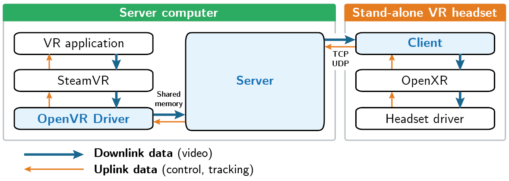
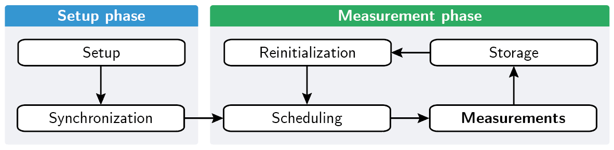
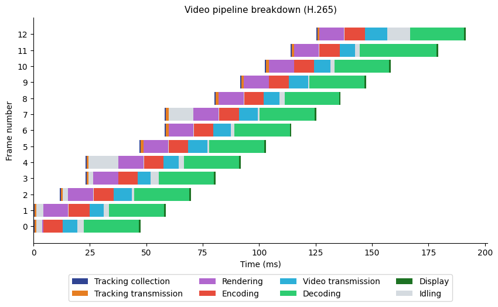

# Wireless VR Bridge

Open-source benchmarking platform for wireless virtual reality.

This software can be used to link a stand-alone VR headset to a PC and stream SteamVR applications. It also enables the easy collection of fine-grained latency and image quality measurements at the key points of the video pipeline. These results can then be used for the detection of latency bottlenecks and perturbations, enabling the evaluation of optimization techniques.

The program is composed of three main components:
- the **OpenVR driver**, handling interface with SteamVR.
- the **server**, handling video compression and orchestrating the entire execution. For simplicity, all the configuration is performed in the server, which propagates it to the other components.
- the **client**, a stand-alone application that displays received frames. On launch, it automatically tries to connect to the first detected local server.

With command-line arguments passed to the server, a series of configurations, called *benchmark passes*, can be defined. Once connected, the system will iterate over those passes, collect measurements during a predetermined time window, and save measurements in CSV files for straightforward analysis.

A Python module is provided to facilitate the loading and preprocessing of measurements. For example, such a graph can easily be created:

The implementation is completely open-source under the MIT license, and contributions are welcome !

## How to use

By default, when launched, the server executable starts in *proof-of-concept* mode, i.e without scheduled measurements. The used codec can be specified with the `--codec=<name>` parameter. For now, the possible values are `h264` and `h265`.

To setup measurements, the `--benchmark` (or `-b`) parameter should be provided, followed by one or more benchmark pass configuration. Each configuration is a string, consisting of the codec name (e.g `h265`) followed by a series of optional semicolon-separated parameters, the full list of which can be found in the help message. Here are a few examples:

- ``wvb_server --benchmark "h264;n=10" "h265;n=10"``
  - Run the benchmark with 2 passes: one in H.264, and one in H.265. To reduce the measured variance, 10 executions are recorded in the first pass, and 5 in the second.
- `wvb_server -b "h265;bitrate=50000" "h265;bitrate=60000" "h265;bitrate=70000"`
  - Collect measurements using the H.265 codec with different bitrate values, allowing to analyze the impact of bitrate on image quality, frame drops and delays.

More detailed documentation on command-line arguments can be printed by passing the `--help` argument.

## How to setup development environment and build

- Clone this repository with `--recurse-submodules` flag
  - If you forgot the flag, you can run `git submodule update --init --recursive` instead.
- Install the [OpenVR SDK](https://github.com/ValveSoftware/openvr/releases)
  - If it is not at a standard location, you can extract the zip and set the `OPENVR_SDK_PATH` environment variable to the root directory.
- Install the AVCodec library
  - The pre-built shared libraries can be downloaded on [gyan.dev](https://www.gyan.dev/ffmpeg/builds/). Extract and set the `FFMPEG_PATH` environment variable to the root directory.
  - Android builds also need to be compiled, for example with [ffmpeg-android](https://github.com/cmeng-git/ffmpeg-android). The `FFMPEG_ANDROID_PATH` environment variable should to be set to the root directory.
- Install SteamVR
- Run CMake a first time and build either the `tests` target, or both the `wvb_driver` and `wvb_server` targets.
- To allow SteamVR to find the driver, run
  - `python ./tools/wvb_driver_control.py enable --driver_dir ./<build dir>/wvb_driver`
  - Run `python ./tools/wvb_driver_control.py status` to check if it worked
  - Run `python ./tools/wvb_driver_control.py disable` to remove the driver
- Download the [Oculus OpenXR SDK](httpscd://developer.oculus.com/downloads/package/oculus-openxr-mobile-sdk/) and extract it in `wvb_client/quest/external/ovr_openxr_mobile_sdk` (such that all the `1stParty`, `OpenXR`, ... subdirectories are directly in it)
- Android builds require the Android SDK, the simplest way being the use of Android Studio. Opening the repository in Android Studio should load the Meta Quest 2 project. Otherwise, open the root directory and load the `wvb_client/quest/build.gradle` project.

## Future work

Various features and improvements could be implemented in the future:

- Automation script to simplify development environment configuration
- More configurable variables in command line arguments
- Motion controller support
- Sound support
- RTP protocol
- Additional metrics for measurements (e.g battery usage)
- Advanced video algorithms (e.g space warp, fixed foveated rendering)
- Reduce decoding time, which is currently the major latency bottleneck. Alternative video codecs or parameters could be compared.

## Notes

- On Windows, the driver **must** be compiled using MSVC, otherwise SteamVR won't be able to load it.
- To access SteamVR logs:
  - Right click on SteamVR window
  - Developer > Web console
- SteamVR returns a handle to a D3D11 texture, which means that the server is built around Direct3D, and is thus only available on Windows. To port it to Linux, it would need to be rewritten with Vulkan, which is not worth the effort yet given the very unstable state of SteamVR for Linux.
